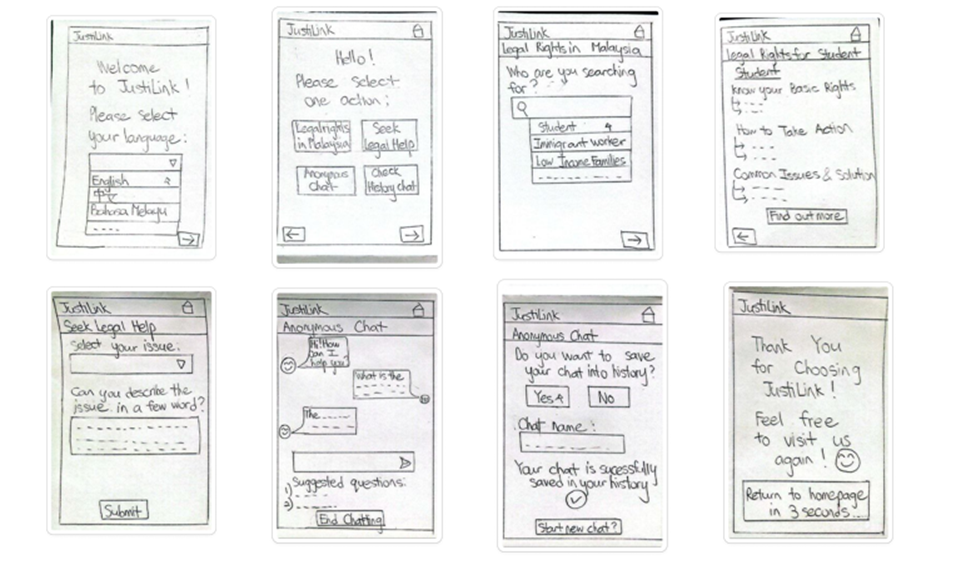
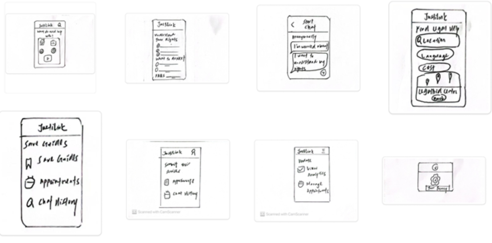
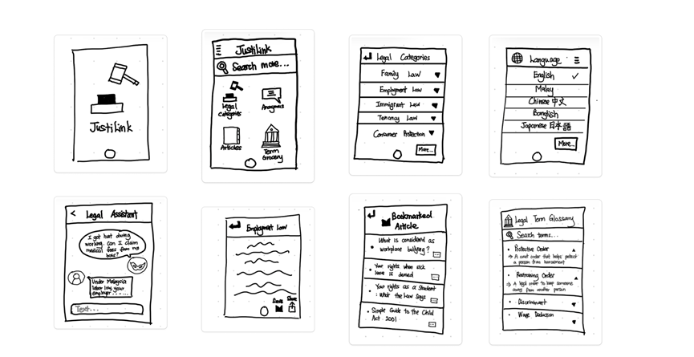
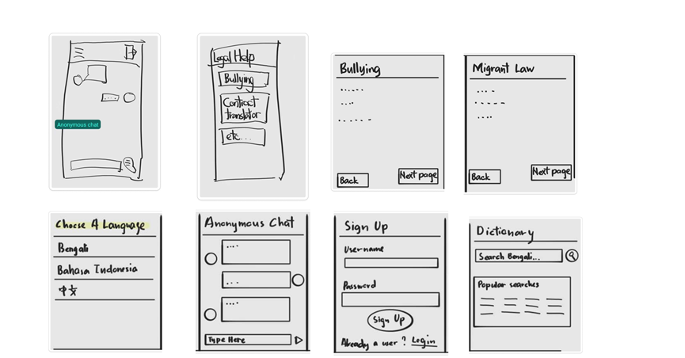
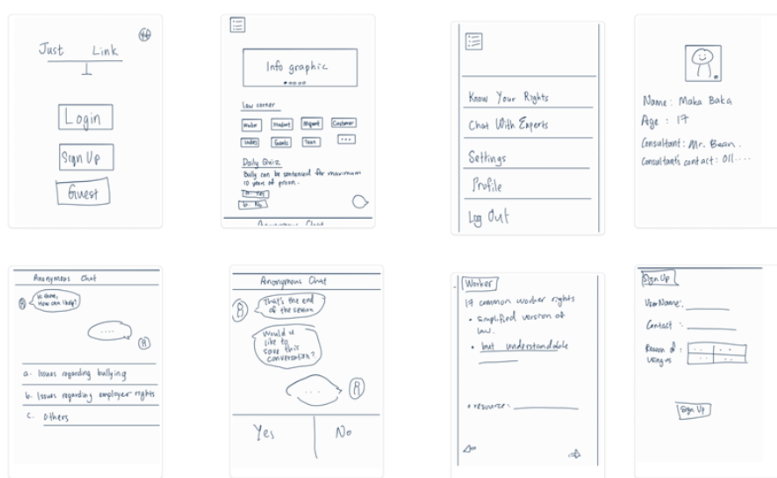

## 🧠 Goal 1: Simplified Legal Content

Many users struggle to understand complex legal jargon. Our platform simplifies legal information into digestible, visually guided content. This makes it easier for everyone — especially those with no legal background — to understand their rights and available resources.

**Storyboard:**

---

## 🕵️ Goal 2: Anonymous Chat

Legal issues are sensitive. Users often feel hesitant or fearful about revealing their identity. We prioritize privacy by integrating an anonymous chat system that allows users to seek help confidently and discreetly.

**Storyboard:**

---

## 📱 Goal 3: Mobile-First, User-Centered Interface

Our interface is designed mobile-first to cater to the majority of users who access services through smartphones. Emphasis is placed on intuitive navigation, user-centered design, and accessibility to enhance the overall experience.

**Storyboard:**

# 🎨 Alternative Design Concepts (Crazy 8s)

The following are design alternatives created by team members during our Crazy 8s brainstorming session. Each concept explores a different approach to enhancing user experience and addressing our core goals: simplification, anonymity, and mobile usability.

---

## 🧑‍🎨 Alternative Design 1 – Lee Jia Yee

---

## 🧑‍🎨 Alternative Design 2 – Leong Jia Ling

---

## 🧑‍🎨 Alternative Design 3 – Gwee Zi Ni

---

## 🧑‍🎨 Alternative Design 4 – Michelle Ho Chia Xin

---

## 🧑‍🎨 Alternative Design 5 – Tay Xin Ying

---

