# 📜 Storyboards
## 🧠 Goal 1: Simplified Legal Content

Many users struggle to understand complex legal jargon. Our platform simplifies legal information into digestible, visually guided content. This makes it easier for everyone — especially those with no legal background — to understand their rights and available resources.

**Storyboard:**

---

## 🕵️ Goal 2: Anonymous Chat

Legal issues are sensitive. Users often feel hesitant or fearful about revealing their identity. We prioritize privacy by integrating an anonymous chat system that allows users to seek help confidently and discreetly.

**Storyboard:**

---

## 📱 Goal 3: Mobile-First, User-Centered Interface

Our interface is designed mobile-first to cater to the majority of users who access services through smartphones. Emphasis is placed on intuitive navigation, user-centered design, and accessibility to enhance the overall experience.

**Storyboard:**

---

# 🎨 Alternative Design Concepts (Crazy 8s)

The following are design alternatives created by team members during our Crazy 8s brainstorming session. Each concept explores a different approach to enhancing user experience and addressing our core goals: simplification, anonymity, and mobile usability.

---

## 🧑‍🎨 Alternative Design 1 – Lee Jia Yee

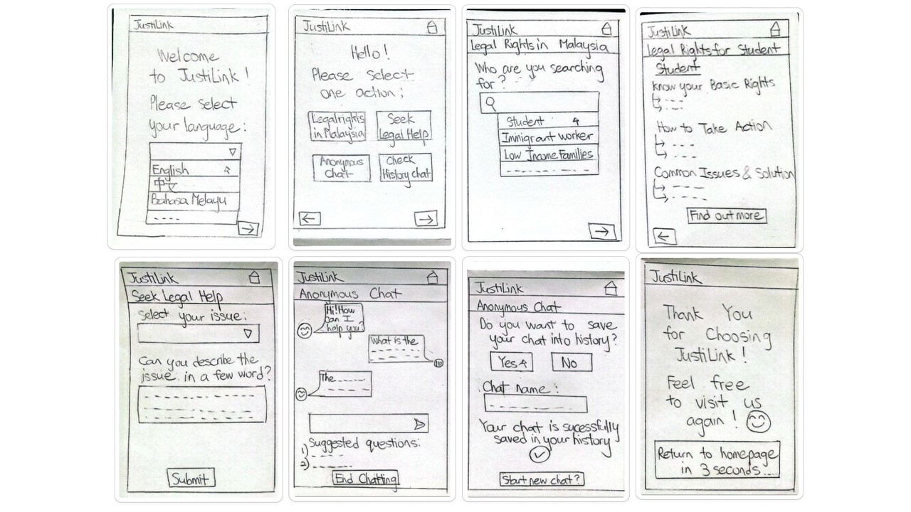

---

## 🧑‍🎨 Alternative Design 2 – Leong Jia Ling

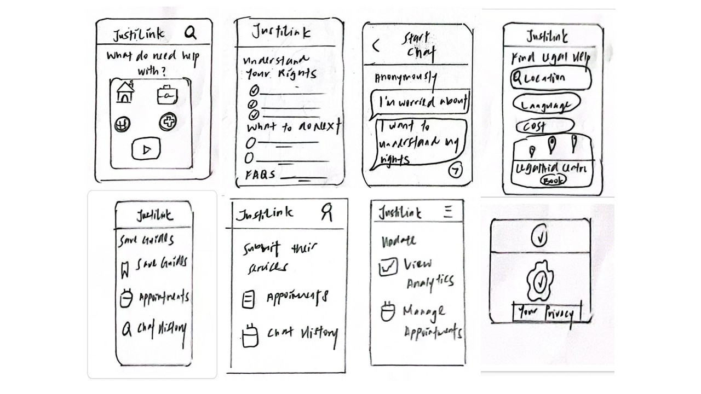

---

## 🧑‍🎨 Alternative Design 3 – Gwee Zi Ni

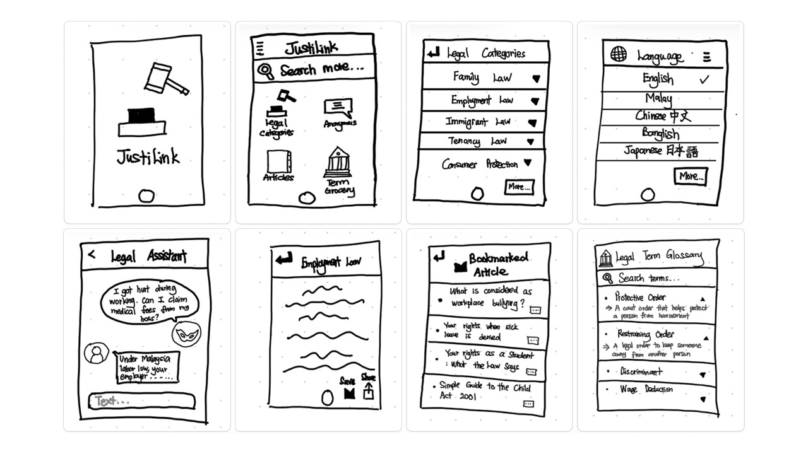

---

## 🧑‍🎨 Alternative Design 4 – Michelle Ho Chia Xin

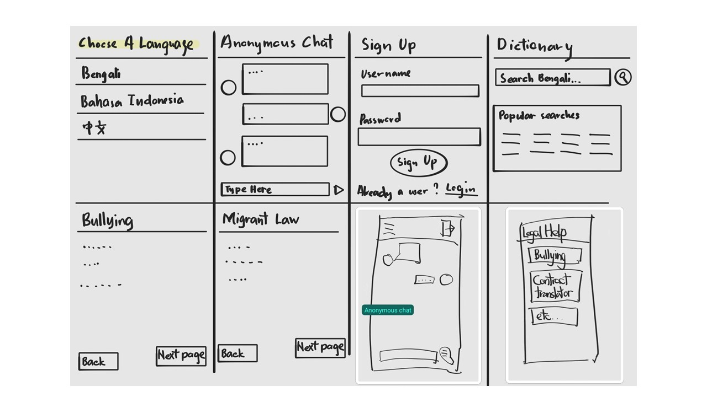

---

## 🧑‍🎨 Alternative Design 5 – Tay Xin Ying

---

# 🗳️ Voted Design Elements & Layouts

The voted design served as an inspiration for all of us during the wireframe development process. Several elements and layouts were adopted, refined, and incorporated into the final wireframe designs.

---

## 🖼️ Voted Design 1

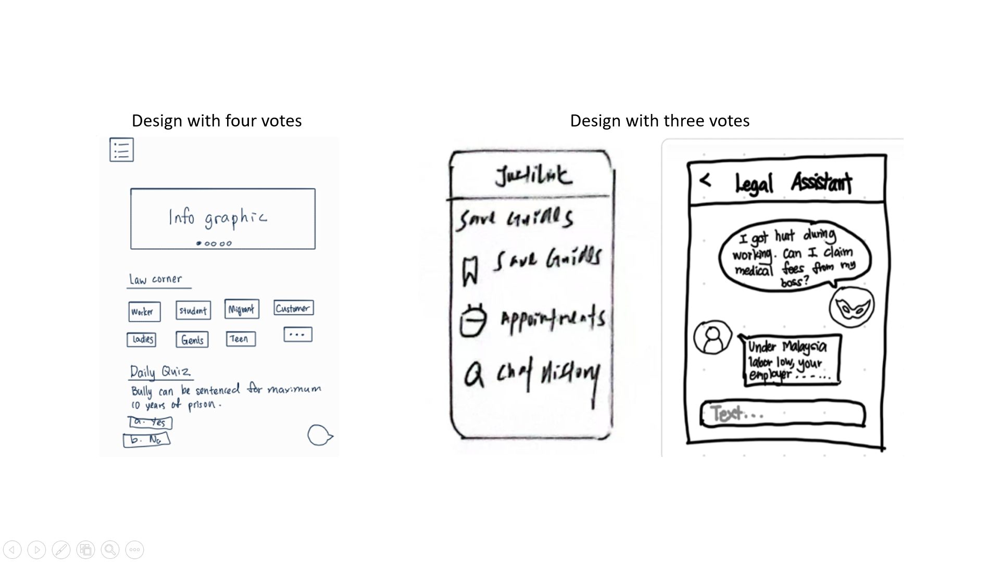

---

## 🖼️ Voted Design 2

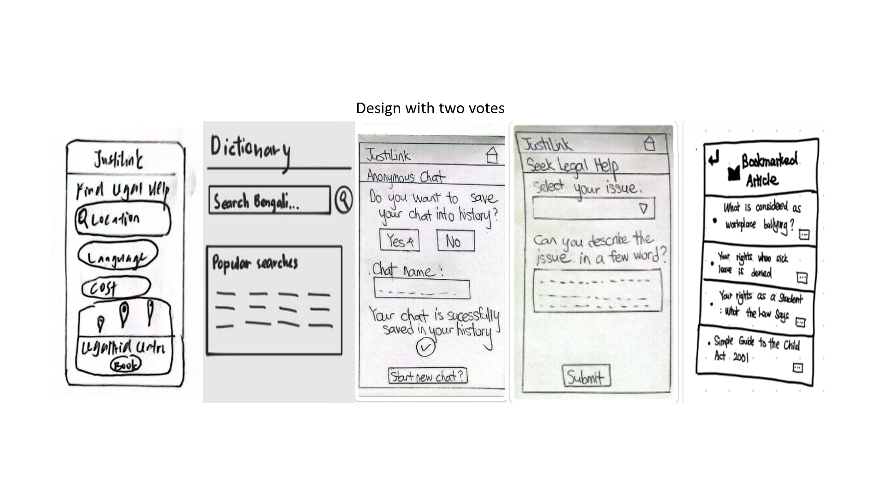

---

## 🖼️ Voted Design 3

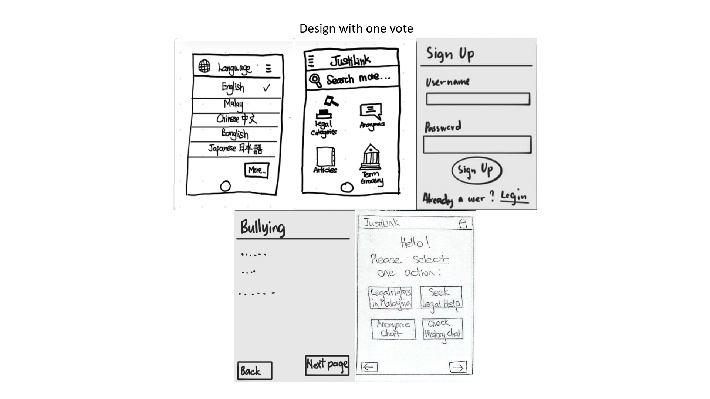

# 🧾 Wireframes & Design Rationale

## Task 1: Understand Legal Content in Simple Language

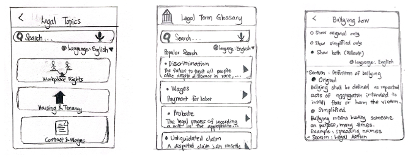

**Design Summary:**  
The wireframes shown above for Task 1 guide users in understanding legal content more easily via:  
1. A legal topic search with integrated language switch,  
2. Consulting a glossary of hard legal terms.  
3. Switch in contents of simplified/original articles reading.  

These designs support users with reduced literacy or language proficiency, such as students and migrant workers which are applied by Golden Rules by Shneiderman, Gestalt Principles and well-defined Usability & UX Goals.

### Shneiderman’s Golden Rules:
- **Rule 1 – Strive for Consistency:**  
  Icons, toggles and layouts that are consistent throughout make it intuitive to navigate.
- **Rule 5 – Offer Error Prevention:**  
  The risk of misinterpretation is reduced by simplified content and a glossary.
- **Rule 6 – Permit Easy Reversal of Actions:**  
  Users are allowed to change between versions of content or language without losing anything.

### Gestalt Principles:
- **Similarity:**  
  The consistent design of toggles and buttons facilitates recognition.
- **Proximity:**  
  Controls are grouped together and make sense, such as search and language toggle.

### Usability & User Experience Goals:
- **Learnability:**  
  The interface is consistent and straightforward, making it new-user friendly.
- **Effectiveness:**  
  The simplified content toggle and glossary ensure that the user will be able to comprehend complicated legal information without getting lost in translation and meanings.
- **Efficiency:**  
  Having search, language switcher, and simplified content easily accessible, users can accomplish their goals using the minimum number of steps and minimal mental effort.

---

## Task 2: Anonymous First Chat Feature

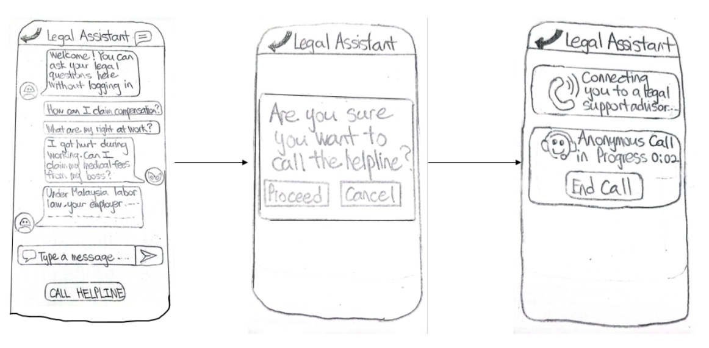

**Design Summary:**  
The wireframe showcases an anonymous chatbot interface designed to help users seek legal assistance in a safe and supportive environment. Users can ask legal questions without log in, ensuring they are protected from the beginning of the chat. The chatbot provides immediate, supportive responses, simulating a real-time conversation that ensures users’ concerns are being heard. If users require more in-depth support, they can choose to escalate the issue to a helpline while it still remains anonymous.

### Shneiderman’s 8 Golden Rules of Interface Design:
- **Rule 1 – Strive for consistency:**  
  The interface maintains consistency through same fonts, button shapes, chat bubble designs, and icons, making it easier for users to recognize patterns.
- **Rule 3 – Offer informative feedback:**  
  The chatbot provides immediate responses after each user input, simulating real-time interaction and ensuring users’ messages are being processed.
- **Rule 5 – Prevent errors:**  
  There are no mandatory forms, logins, or complex navigation steps which can minimize opportunities of user mistakes when they are using chatbot.
- **Rule 7 – Support internal locus of control:**  
  The user has full control over how much information they provide and when, promoting a sense of trust to the system.

### Gestalt Principles:
- **Proximity:**  
  The input box, messages, and "Send" logo are grouped closely to represent their related function which engages with the chatbot.
- **Similarity:**  
  All chat bubbles share a similar shape and icon, enhancing recognition between bot and user messages.
- **Continuity:**  
  The flow from entering a question, getting a response, calling a helpline guides the user from simple to more complex legal help.

### Usability & User Experience Goals:
- **Learnability:**  
  Clean layout with a clear welcome message and suggested questions helps users understand what to do without a tutorial.
- **Efficiency:**  
  The immediate responses from the chatbot and suggested questions reduce the time needed to get legal help.
- **Satisfaction:**  
  Users feel respected without being stressed to give personal information.

---

## Task 3: Mobile-First, User-Centered Interface

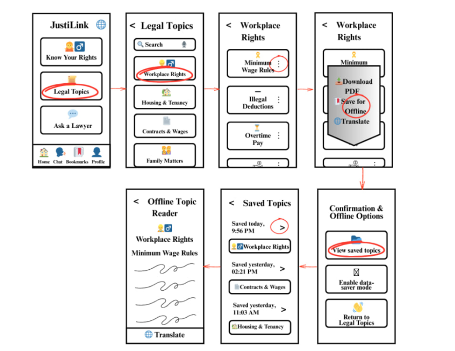

**Design Summary:**  
The Task 3 (Mobile-First, User-Centered Interface) design effectively applied several of Shneiderman's Golden Rules, Gestalt principles, and essential usability and user experience goals, with special focus on responsiveness, simplicity, and accessibility for users on basic smartphones and limited data plans.

### Shneiderman’s Golden Rules:
- **Rule 1 – Strive for consistency:**  
  Icons, layouts, and navigation buttons remain consistent across all screens, ensuring that users are not confused when transitioning from one page to another.
- **Rule 4 – Design dialogs to yield closure:**  
  A message appears after actions like “Download for offline use” or “Bookmark,” confirming success and reassuring the user.
- **Rule 5 – Prevent errors:**  
  The design avoids complex animations, heavy images, or small buttons, reducing the chance of user errors or missed taps on mobile devices.
- **Rule 7 – Keep users in control:**  
  Features like language toggling, offline reading, and bookmarking are clearly visible, giving users the freedom to manage their experience.
- **Rule 8 – Reduce short-term memory load:**  
  Legal topics are grouped into categories with clear icons and consistent terminology, so users don’t have to memorize where each resource is located.

### Gestalt Principles:
- **Similarity:**  
  All buttons use the same shape and style for easier recognition.
- **Proximity:**  
  Related content like topic titles and action buttons are grouped closely together.
- **Figure and Ground:**  
  The high-contrast layout makes reading easy, even on older screens.

### Usability & User Experience Goals:
- The interface is clean and simple for fast navigation.
- Buttons are large and touch-friendly, reducing effort and frustration.
- The app loads quickly and allows offline access to help users save data.
- The layout is intuitive, helping first-time users understand how to use the app easily.

**The design meets the requirements of Task 3 by providing a mobile-first interface that is responsive, lightweight, and easy to navigate—ensuring accessibility for users with basic smartphones, limited data plans, and slow internet connections.**

---

# 🎭 Design Metaphors

Design metaphors help users relate unfamiliar digital interfaces to familiar real-world concepts, improving intuitiveness and usability.

---

## 🪞 Metaphor 1

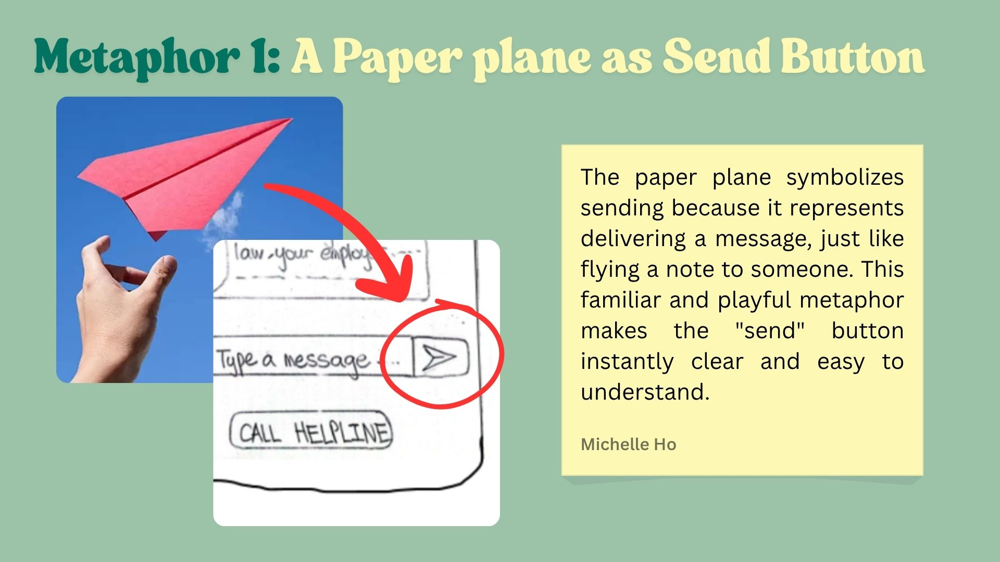

---

## 🪞 Metaphor 2

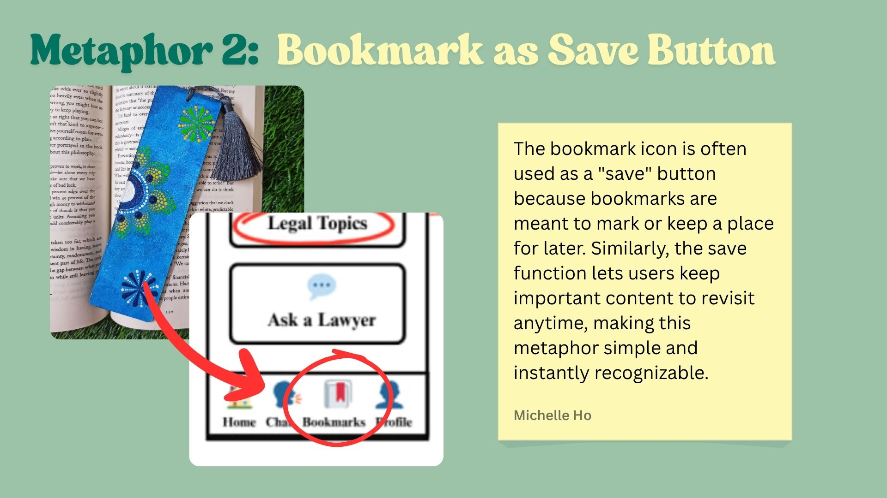

---

## 🪞 Metaphor 3

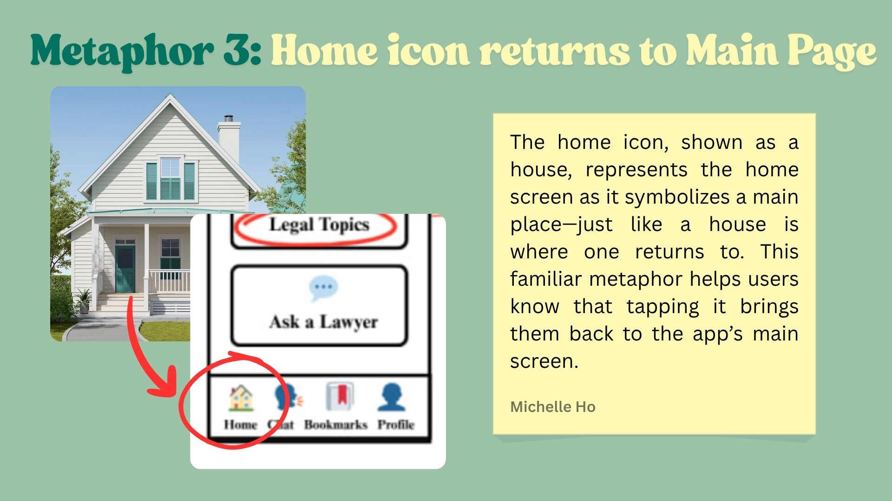

---

## 🪞 Metaphor 4

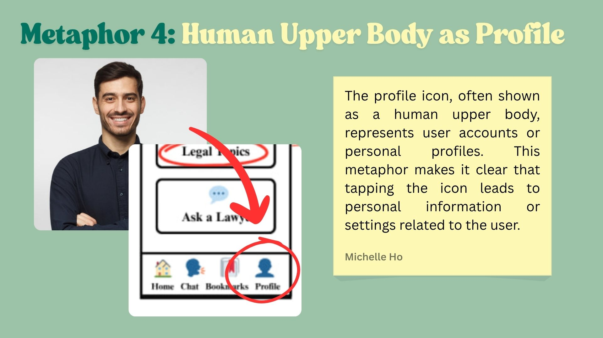

---

## 🪞 Metaphor 5

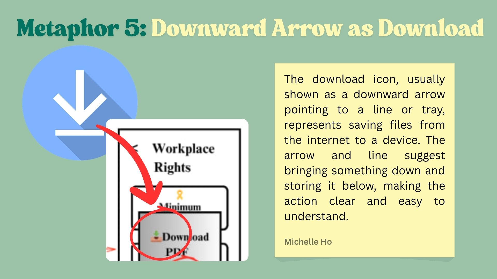

---

## 🪞 Metaphor 6

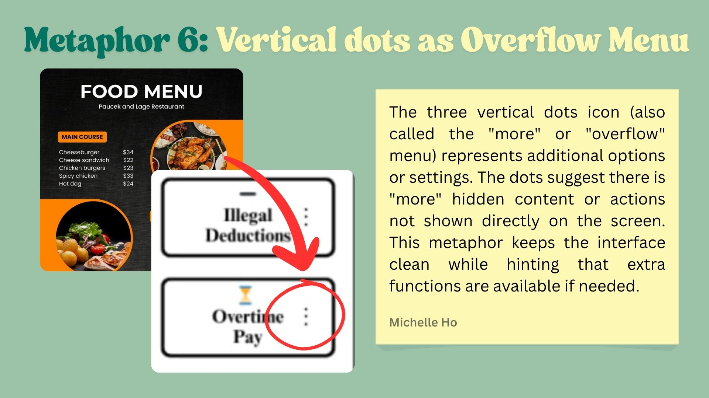

---

## 🪞 Metaphor 7

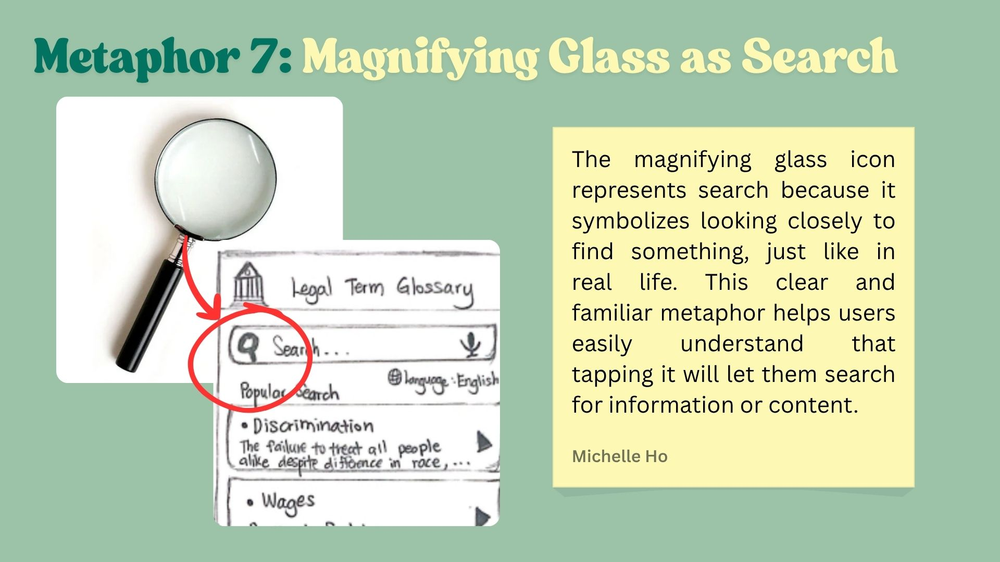

---

## 🪞 Metaphor 8

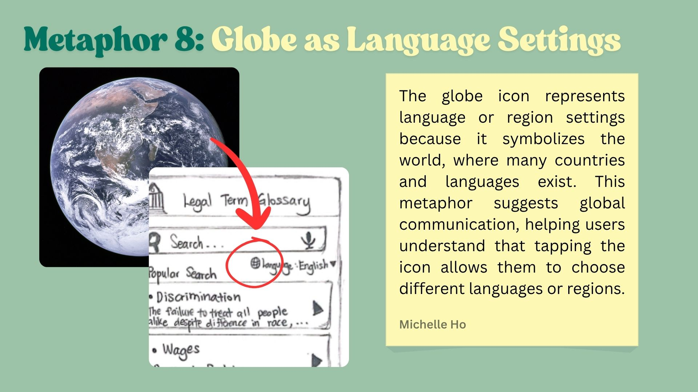

---

## 🪞 Metaphor 9

