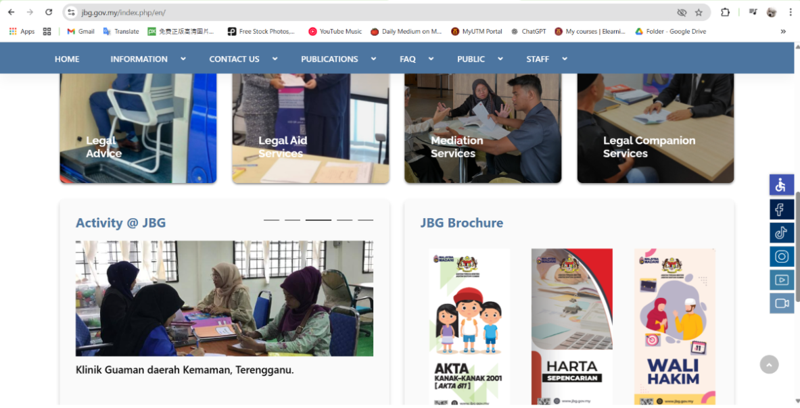
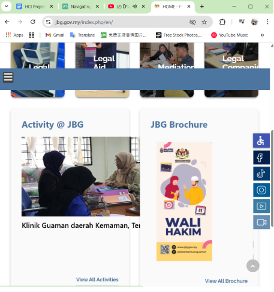
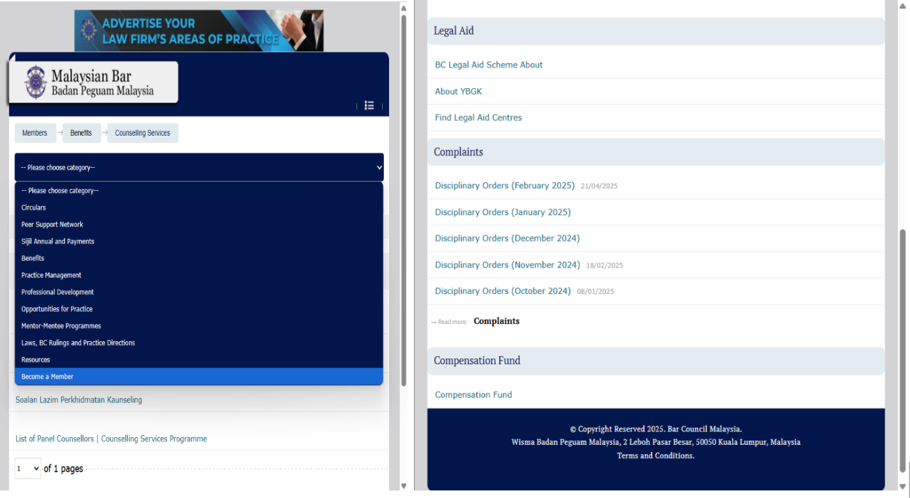

# PROJECT 1 - PROJECT PROPOSAL

## 1) Problem 🤔
### 1.1 Description of Problem Space
Access to legal aid is crucial for ensuring justice and protecting rights, but many young people, immigrants, and marginalized communities face significant barriers when seeking legal help. Three main problems that can be seen as barriers are: complexity and legal jargon, outdated, non-mobile-friendly interfaces, and fear of formal institutions along with a lack of anonymity.
These issues hinder equal access to justice, which is a key focus of UNESCO’s Sustainable Development Goal 16: Peace, Justice and Strong Institutions. Addressing these barriers is essential to build inclusive and accessible legal systems for all.

### 1.3 Problem 2: Non-Mobile-Friendly, Outdated Interfaces

In the digital age, **mobile accessibility is essential**—especially for young users, marginalized communities, and immigrants who often rely on smartphones as their primary or only means of accessing the internet. However, many official legal aid or reporting websites in Malaysia remain outdated, difficult to navigate on mobile devices, and not optimized for intuitive use.

This creates significant barriers for individuals who may already struggle with **language challenges**, **limited digital literacy**, or **unstable internet access**. During urgent or distressing situations, the inability to quickly and easily access legal help via mobile can result in **delays in justice**, **increased vulnerability**, and a **sense of helplessness**.

A lack of **responsive, mobile-friendly design** effectively excludes the very communities that most need accessible legal support.

---

#### Jabatan Bantuan Guaman (JBG) Website: Desktop vs Mobile View
Source: <a href="https://www.jbg.gov.my/index.php/en/">JBG website</a>

<table>
  <tr>
    <td align="center">
       
      <strong>Figure 1.3.0</strong> Full screen PC view
    </td>
    <td align="center">
       
      <strong>Figure 1.3.1</strong> Mini-window view
    </td>
    <td align="center">
       
      <strong>Figure 1.3.2</strong> Mobile view
    </td>
  </tr>
</table>

> ⚠️ The 
<a href="[https://aplikasi.jbg.gov.my/myjanjitemu/index.php#features]"> JBG website</a> is clearly optimized for full-screen desktop viewing. However, when accessed in smaller windows or on mobile devices, it shows significant issues:
> - Images fail to resize properly  
> - Overlapping icons obstruct the text  
> - Layout becomes inconsistent and messy

These problems violate the usability goals of **Accessibility** and **Effectiveness**, as well as the UX goals of being **Accessible** and **Satisfying**.

---

#### MyJanjiTemu Interface Issues

   
  <strong>Figure 1.3.3</strong>: Interface of <a href="https://aplikasi.jbg.gov.my/myjanjitemu/index.php#features">MyJanjiTemu</a>

The **MyJanjiTemu** feature within the JBG website is intended to help users make legal advising appointments. However:

- The top-right menu icon is **non-functional**
- Critical sections like **available services**, **branch locations**, and **FAQs** are inaccessible

This suggests poor maintenance or an unfinished implementation, making the service ineffective in practice.

---

#### Malaysian Bar Council Website: Text-Heavy & Unengaging

   
  <strong>Figure 1.3.4</strong>: Malaysian Bar Council Website UI  
  Source: <a href="https://www.malaysianbar.org.my/">Malaysian Bar</a>

The **Malaysian Bar Council website** heavily relies on dense blocks of text, minimal graphics, and a bland color scheme, resulting in:

- A **cognitively demanding** experience  
- An interface that is **uninviting** for less literate or younger users

This violates UX principles of being **Enjoyable**, **Motivating**, and **Emotionally Fulfilling**.

### 1.4 Problem 3: Fear of Formal Institutions and Lack of Anonymity

Recently, an AI deepfake scandal at **Foon Yew High School** raised serious concerns about **digital safety** and **trust in institutions**. A female student revealed that her photo was used to generate explicit AI-generated images, which were then sold and distributed online. Despite the seriousness of the case, her request to report the incident to police was rejected by a school authority—allegedly to protect the school's reputation. The perpetrator received only minor disciplinary action.

   
  <strong>Figure 1.4.0</strong>: A screenshot of the victim’s statement posted on Instagram

This case highlights the **fear and mistrust** many victims feel when seeking help from formal institutions. The school’s passive response and lack of confidentiality discouraged others from coming forward. Only after the incident went viral on social media did more victims—some as young as 14—begin to share their own experiences.

---

From a **Usability and UX perspective**, this situation reveals major flaws in current reporting systems. The absence of an:

- **Anonymous**
- **Intuitive**
- **Emotionally supportive**

reporting tool created a significant barrier for victims—especially young users—who feared **stigma**, **judgment**, or **retaliation**.

To address this, UX design should prioritize:

- 🛡️ **Safety**
- 💬 **Emotional reassurance**
- 🖱️ **Ease of use**

These elements are especially crucial for **young**, **digitally vulnerable**, or **first-time** users navigating traumatic experiences.

---

To encourage reporting and protect users, legal aid systems must align with key usability and UX goals:

### Usability Goals:
- **Learnability** – Easy to understand for first-time users  
- **Accessibility** – Inclusive for users with diverse needs or devices  
- **User Confidence** – Instills trust and a sense of control  

### UX Goals:
- **Emotional Satisfaction** – Comfort and support during stressful tasks  
- **Trust** – Confidential, non-judgmental, and secure user experience  

These principles are essential to design **tools that empower victims to seek help without fear**.

## 2) Proposed Solution 💡

### 🦸🏻JustiLink 

A human-centered legal aid platform specifically designed for disadvantaged groups such as young people, migrants, and marginalized populations.Unlike traditional legal aid methods, JustiLink focuses on:

- A mobile-first design approach
- Integration of visual and multilingual assistance
- User privacy through anonymous help interface

### 🧩 Key Features of JustiLink

#### 1.  Simplified Legal Content 📋

One of the primary issues users face with current systems is overly complex of legal language. JustiLink solve this problem through several solutions:

#### - Plain Language Rewriting
- All legal content is rewritten in plain, conversational language.
- Complex legal terms are translated into simpler equivalents.

#### - Visual Step-by-Step Guides
- Legal issue comes with the flowcharts, diagrams, or illustrations.
- Based on dual coding theory,which combining text with images signifantly enhances understanding and memory.

#### - Educational Videos
- Short multilingual videos (1–3 minutes) on explaining processes and users' rights through real-life scenarios
- Delivered in local accents with subtitles and are highly relatable and comprehensible.

#### - Multilingual Support and Accessibility
- Offers translation in Malay, English, Tamil, Mandarin, and Bahasa Indonesia.
- Accessibility features include:
  - Text-to-speech
  - Change in font size
  - High-contrast mode are built into the interface to support users with visual impairments or reading difficulties.

#### - HCI Principles Applied
- Cognitive load reduction through simplified content and visuals
- Recognition over recall using icon-based categories
- Inclusive design ensures access across diverse users

#### 2. Mobile-First, User-Centered Interface 📱
JustiLink is developed using a mobile-first strategy, recognizing that mobile is the primary access point for many users.

#### - Responsive and Simplified UI
- Optimized for small screens with:
  - Minimal text
  - Large icons
  - Easy-to-use navigation paths
- Icons represent legal topics visually(🏠 = landlord issues, ⚖️ = justice)

#### - Guided Navigation and Progressive Disclosure
- Users go through a step-by-step flow with only essential information shown at each stage.

#### - Smart Search and Categorization
- Keyword suggestions based on user input
- Legal issues are categorized by themes like:
  - “Workplace Issues”
  - “Family Law”
  - “Student Rights”

#### - Feedback and Affordance
- Real-time feedback(animations, confirmations, haptics)
- Interface design based on user expectations

#### - HCI Principles Applied
- Mobile usability which tailored for handheld devices with minimal scrolling and fast load times
- Progressive disclosure which reduces information overload and improved focus
- Visibility of system status which ensures users are always aware of system status

#### 3. Anonymous First Chat Feature 🤫
To eliminate the fear of judgment, exposure or retribution, JustiLink offers an "Anonymous First Chat" to build trust and reduce user hesitation.
#### - Zero-Barrier Entry
- Users can initiate the conversation without registration or sharing personal information.

#### - Chatbot and Human Hybrid Model
- NLP chatbot addresses general legal queries from a trained knowledge base.
- Escalate to human legal consultants without restarting the conversation.

#### - Gradual Disclosure for Sensitive Users
- Users are encouraged to register an account for additional services such as scheduling appointments or file uploading. 

#### - Secure, Encrypted Conversations
- Conversations are end-to-end encrypted.
- No data is retained without their permission.

#### - Empathetic Interaction Design
- Chat interface is designed with a calming color palette and friendly microcopy like “You're not alone".

#### - HCI Principles Applied
- Trust-centered design which builds confidence through anonymity and security.
- Affective computing which interface elements are emotionally intelligent and empathetic.
- Low-commitment interaction which reduces entry friction and encourages trial use.

## 3) Target Users 🎯
### 👥 Making Legal Help Accessible for All

JustiLink is designed to solve and address legal problems for people from different social backgrounds. The key target user groups are:

- **Youths**
- **Immigrants**
- **Low income families**

These groups often face legal issues but lack of suitable platform that provides useful solutions. Here's how JustiLink supports each of them:

### 👩‍🎓 Youths  

**Why they need JustiLink:**

- Frequently experience legal problems whenever in daily life or online.
- Lack of awareness of how to protect themselves legally.
- Might have faced bullying or digital harassment.
- Unable to find a trustworthy legal institution and fear seeking help.

**How JustiLink helps:**

- Offers an “anonymous first chat” feature to reduce the fear of judgment.
- User friendly with providing simplified language to access legal information and take appropriate action.

### 🌍 Immigrants  

**Why they need JustiLink:**

- Lack of proficiency in the local language.
- Difficult to seek advice and understand legal documents.
- Risk of exposure when dealing with sensitive concerns like immigration status.

**How JustiLink helps:**

- Provides multilingual support by making legal information accessible to non-native speakers.
- Legal services are categorized by issues such as labor disputes and housing issues, making it easier to find and access the relevant support.
- Includes an anonymous feature allows users to seek advice discreetly.

### 💸 Low-Income Families  

**Why they need JustiLink:**

- Often unable to afford legal service.
- Face important legal matters such as housing disputes or family matters.
- Fear or concern about being judged due to their family and social background.

**How JustiLink helps:**

- Provides easy access to free or low-cost legal resources to ensure financial barriers are able to solve important legal matters.
- Provides emotional safety through anonymous features.
- Encourages users to seek help without fear of discrimination.

