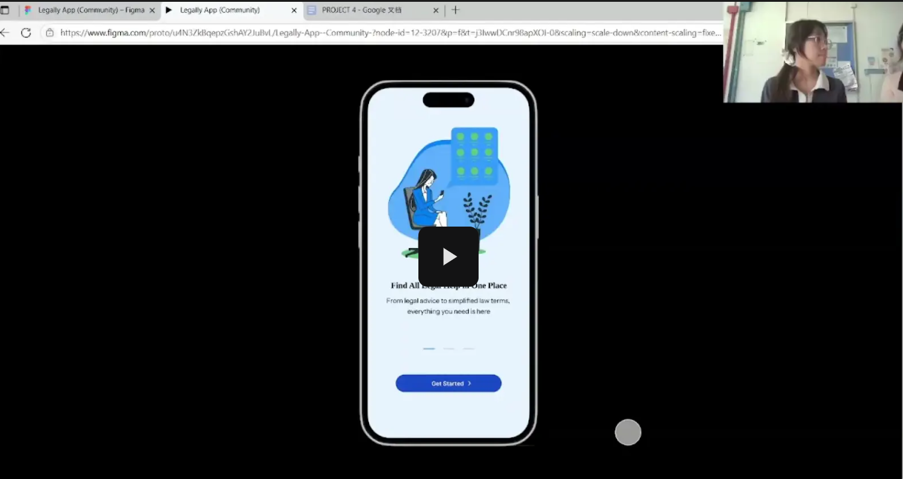

# Prototyping and Evaluation
## 🤗 Introduction
Our team developed a high-fidelity prototype using Figma to simulate three main tasks aligned with the goals of our project, including allowing users to understand legal information in simple language, allowing users to obtain professional help safely through anonymous chat functions and access legal resources smoothly.

The usability testing took place in several locations. Both User 1 and User 2 completed their sessions in KTDI; while User 3's session took place in L50. The equipment used was laptop and handphone. The prototype was displayed using a laptop, with the front camera continuously recording the user’s facial expressions throughout the test. Meanwhile, the handphone was used to film the session in another angle from a wider angle that included the host in the camera frame. 

To evaluate the usability of our design, three main tasks were tested among three users, each user representing one target group of our project. User 1 representing the first targeted user group - students and youths; User 2 representing the second targeted user group - migrant workers; while User 3 representing the last targeted user group - low income individuals with limited legal knowledge.

Each usability test was conducted by a group member. Michelle Ho Chia Xin was responsible for testing with User 1, Leong Jia Ling handled the session with User 2, and Tay Xin Ying facilitated the test with User 3. This division of tasks helped maintain consistency and focus throughout the evaluation process.

---
##  📷 Screenshot of Prototype

   
  <strong>Figure 1</strong>: JustiLink's entry screen with access options and value proposition

The JustiLink entry screen welcomes users with a clear value proposition and provides three access points: Login for returning users, Sign Up for account creation, and Continue as Guest for immediate access. The tagline "Find All Legal Help in One Place" immediately communicates the app's comprehensive legal assistance purpose.

---

   
  <strong>Figure 2</strong>: JustiLink's homepage with categorized legal service access

The JustiLink homepage provides direct access to core legal services through four key features: Know Your Rights (simplified legal explanations), Legal Glossary (term definitions), FAQ section (common queries), and Anonymous Chat (confidential consultation). This layout ensures users can immediately find their preferred method of legal assistance.

---

 
  <strong>Figure 3</strong>: Informational screen with categorized content

This screen delivers structured informational content, organized into clear sections with definitions and practical examples. It prioritizes user education through simplified explanations and actionable guidance.

---

 
  <strong>Figure 4</strong>: Anonymous chat interface with real person and chatbot options

The Anonymous Chat screen offers confidential legal support through both human experts and AI chatbot, with pre-defined topic selections to streamline user queries. This dual-option approach balances immediate assistance with personalized guidance.

---

 
  <strong>Figure 5</strong>: Glossary interface with toggleable definition formats

The Legal Term Glossary screen offers users flexible access to legal definitions through three viewing options: original legal wording, simplified explanations, or both simultaneously. The example of word demonstrates the app’s core functionality—bridging complex legal language with everyday understanding.

---

 
  <strong>Figure 6</strong>: Interface with saved content in library and FAQ section

The interface screen combines saved offline content and a comprehensive FAQ section, enabling users to access both personalized resources and general legal guidance. The dual-function design supports both proactive research and immediate problem-solving (FAQ).

---

 
  <strong>Figure 7</strong>: Multilingual interface showing Bahasa Indonesia content

The interface demonstrates JustiLink's multilingual capability by presenting law guidance in Bahasa Indonesia while maintaining the app's signature structure of simplified explanations and legal references. 

---

## 🧾 Briefing notes – prepared by {TAY XIN YING}
Hi xxx, welcome to the usability testing of JustiLink app!
We will start off by introducing a little about our app to you. The JustiLink application is designed to help users- especially students, migrant workers, and individuals with limited legal knowledge or low income individuals to access legal information and guidance in a simplified and convenient way.
Before starting our test, I would like to ask for your consent. Do you agree to take part in our usability test?
Thank you.

**For Persona 1(Student):**

{In this test, you will act as a high school student who is currently facing bullying. You may try to explore our app, to see if you can obtain necessary help through our app.

This is your task, “Understand legal content in simple language”. Please read out your task. For your information, for whatever reason you are unable to complete the task or could not figure out how to complete the task, you should say loudly “terminate”. You may begin the task now.

This is your task, “Chat anonymously to obtain legal help”. Please read out your task. For your information, for whatever reason you are unable to complete the task or could not figure out how to complete the task, you should say loudly “terminate”. You may begin the task now.}

**For Persona 2 (Migrant worker):**

{In this test, you will act as a migrant worker with limited legal knowledge and doesn’t understand English at all. You may try out our app to see if you can understand the translated and simplified version of legal content.

This is your task, “Understand legal content in simple language”. Please read out your task.For your information, for whatever reason you are unable to complete the task or could not figure out how to complete the task, you should say loudly “terminate”. You may begin the task now.

This is your task, “Access any legal aid resources”. Please read out your task. For your information, for whatever reason you are unable to complete the task or could not figure out how to complete the task, you should say loudly “terminate”. You may begin the task now.}

**For Persona 3(Low-income individual):**

{In this test, you will act as a low income individual with limited legal knowledge. You may try to seek some legal information regarding labour law or employee’s rights through our app. Let’s see if you will like the simplified version of complicated legal content!

This is your task, “Understand legal content in simple language”. Please read out your task.For your information, for whatever reason you are unable to complete the task or could not figure out how to complete the task, you should say loudly “terminate”. You may begin the task now.

This is your task, “Chat anonymously to obtain legal help”. Please read out your task. For your information, for whatever reason you are unable to complete the task or could not figure out how to complete the task, you should say loudly “terminate”. You may begin the task now.

This is your task, “Access any legal aid resources”. Please read out your task. For your information, for whatever reason you are unable to complete the task or could not figure out how to complete the task, you should say loudly “terminate”. You may begin the task now.}

**Interview questions:**

- What is the thing you like the most about our app?

- Do you find any part of our app problematic?

- What improvements on our app can be done?

---

## 🎥 Testing With Users
### Task 1: Understand legal content in simple language

**Xin Yee’s task 1 video:**

 
*click here to watch the video👆*  

**Evelyn’s task 1 video:**

 
*click here to watch the video👆*  

**Yao Ting’s task 1 video:**

 
*click here to watch the video👆*      

### Task 2: Chat anonymously to obtain legal help

**Xin Yee’s task 2 video:**

 
*click here to watch the video👆*  

**Yao Ting’s task 2 video:**

 
*click here to watch the video👆*      

### Task 3: Access any legal aid resources

**Evelyn’s task 3 video:**

 
*click here to watch the video👆*  

**Yao Ting’s task 3 video:**

 
*click here to watch the video👆*  

---

## 🧐 Observations - prepared by {MICHELLE HO CHIA XIN, LEONG JIA LING, GWEE ZI NI, TAY XIN YING}

### Task 1 - Understand legal content in simple language

**User 1: Teoh Xin Yee (portraying a student)**
1.	User 1 reads and comprehends the task.
2.	She proceeds through the new user introduction screens.
3.	She logs in as a returning user using a previously registered username and password.
4.	Once on the homepage, she scrolls around and selects the Glossary of Legal Terms.
5.	Inside the glossary, she taps on the term “Bullying”.
6.	She reads both the original legal definition and its simplified explanation.
7.	She returns to the homepage and navigates to the “For You” section.
8.	She taps on a content block labeled “Students & Youth Protection” (a square panel with a background image and the title).
9.	In the “Students & Youth Protection” section, she scrolls through the content and chooses to read the article titled “Bullying & Harassment At School.”
10.	After scanning the article, she taps the save button for offline access.
11.	A success pop-up appears at the bottom of the screen with a view button; she clicks it to open the Library interface.
12.	She sees all her saved articles there, then returns to the homepage.

**User 2: Evelyn Ang (portraying a migrant worker)**
1.	User 2 reads and comprehends the task.
2.	She proceeds through the new user introductory screens.
3.	She signs up by entering a username, email, and password.
4.	Upon reaching the homepage, she switches the language to Indonesian.
5.	She scrolls through the homepage and selects the “Glosarium Istilah Hukum” (Glossary of Legal Terms).
6.	Within the glossary interface, she uses the search bar to look up the term “Dakwaan Resmi” in Indonesian.
7.	She reads both the original and simplified definitions of the term.
8.	She then uses the back button to return to the glossary list page (the screen showing a full list of legal terms) and searches for another term: “upah” (wages).
9.	After reading the entry, she returns to the homepage.

**User 3: Chun Yao Ting (portraying a low-income individual)**
1.	User 3 reads and comprehends the task.
2.	He proceeds through the new user introduction screens.
3.	He chooses “Continue as Guest” to skip sign-up.
4.	He scrolls through and explores the homepage.
5.	He selects the Glossary of Legal Terms.
6.	In the glossary interface, he taps on the term “Discrimination.”
7.	He reads both the original and simplified definitions.
8.	He uses the back button to return to the glossary list page and checks the definitions for the terms “wages” and “probate.”

### Task 2 - Chat anonymously to obtain legal help

**User 1: Teoh Xin Yee (portraying a student)**
1.	User 1 reads and comprehends the task.
2.	She taps on the Consultation button from the homepage.
3.	She reads the introductory explanation about the anonymous chat feature.
4.	She selects “Students & Youth Rights” from the list of suggested inquiries.
5.	She reads the chatbot's follow-up prompt asking for a brief description.
6.	She taps on the “Chat with real person” button.
7.	She types her situation into the chatbox.
8.	She receives a response from the legal advisor and reads through the suggested steps and advice.
9.	After reviewing the information, she ends the session and returns to the homepage.

**User 3: Chun Yao Ting (portraying a low-income individual)**
1.	User 3 reads and comprehends the task.
2.	He scrolls horizontally to view the app’s values, mission, and vision.
3.	He explores the homepage to look for consultation options.
4.	He notices multiple shortcut buttons for consultation, including “Speak Up,” “Consultation,” and a chatbox icon in the navigation toolbar.
5.	After trying several of these options, he selects the Consultation button on the homepage.
6.	He reads the introductory explanation about the anonymous chat feature.
7.	He selects “Employment and Labour” from the suggested inquiry categories.
8.	He types his question: “What are the steps to apply for sick leave?”
9.	He receives a response detailing the application steps.
10.	He accesses and reviews the chat history related to his inquiry.
11.	He returns to the homepage and completes the usability testing.

### Task 3 - Access any legal aid resources

**User 2: Evelyn Ang (portraying a migrant worker)**
1.	User 2 reads and understands the task.
2.	She clicks “Kenali Hak Anda” and selects “Hak Pekerja di Tempat Kerja” to access the list of content about her rights.
3.	She uses the back button to return to the home page.
4.	She finds that she can also access the same targeted page through the recommended topics on the home page.
5.	She selects “Gaji Terlambat / Tidak Dibayarkan” to learn about her rights regarding delayed or unpaid salary.
6.	After reading and understanding the content, she clicks “Simpan untuk Offline” to save the information.
7.	She views the documents that have been saved.
8.	She uses the back button to return to the home page.
9.	She clicks “Kenali Hak Anda” again to explore more legal topics.
10.	She selects “Hak Cuti Kayawan” and clicks “Cuti Sakit.”
11.	She reads all the content and clicks “Simpan untuk Offline” again to save it.
12.	She uses the back button to return to the list of contents.

**User 3: Chun Yao Ting (portraying a low-income individual)**
1.	User 3 reads and comprehends the task.
2.	He clicks “Workplace Rights” from the recommended topics on the home page to access the list of content about the topic.
3.	He uses the back button to return to the home page.
4.	He finds that he can also access the same targeted page by clicking “Know Your Rights” and then selecting “Workplace Rights.”
5.	He clicks “Delayed or Missing Salary” to learn about his rights regarding delayed or unpaid salary.
6.	After reading and understanding the content, he clicks “Simpan untuk Offline” to save the information.
7.	He clicks “Ask for More” to enter the anonymous chat page.
8.	He clicks the home icon to return to the home page.
9.	He accesses the same targeted page again by clicking “Know Your Rights” and selecting “Workplace Rights.”
10.	He clicks “Save for Offline” to save additional information.
11.	He clicks “View” to see the list of saved content.
12.	He selects “Delayed or Missing Salary” from the saved list to read the information again.
13.	He clicks the home icon to return to the home page.
14.	He clicks the library icon to view all the content that has been saved.

### User Interview Result
**User 1: Teoh Xin Yee**

**Question 1:** What is the thing you like the most about our app?
-	The legal terms translation feature, which transforms complicated legal jargon into simple and understandable language.
-	Particularly beneficial for individuals who are not experts in the legal field, including senior citizens and young people with lower exposure to legal matters.

**Question 2:** Do you find any part of our app problematic?
-	The font used in the legal resources section lacks sufficient contrast with the background, making it difficult to read.
-	The font size is also considered too small, affecting readability.

**Question 3:** What improvements on our app can be done?
-	Increase the font size for better readability.
-	Improve the colour contrast between the font and the background to ensure clear visibility.
-	Avoid using font colours that are similar to the background colour.

**User 2: Evelyn Ang**

**Question 1:** What is the thing you like the most about our app?
-	The "Save for Offline" feature, which allows access to legal resources without the need for an internet connection.

**Question 2:** Do you find any part of our app problematic?
-	In the legal glossary section, users are required to click a small icon on the right side to access definitions.
-	Users prefer to be able to click anywhere within the sector to navigate to the corresponding page.

**Question 3:** What improvements on our app can be done?
-	Expand the clickable area in the legal glossary section to include the entire sector, not just the icon.
The "Show Both Meaning" checkbox is perceived as redundant. Users suggest only providing "Show Original Legal Definition" and "Show Simplified Meaning" checkboxes, allowing them to tick both if they wish to view both meanings simultaneously.

**User 3: Chun Yao Ting**

**Question 1:** What is the thing you like the most about our app?
-	The legal resources or articles section, enhanced with illustrations, making the app more visually attractive and engaging.

**Question 2:** Do you find any part of our app problematic?
-	The buttons in the new chat section are too small, leading to frequent mispresses.
-	The back button is also considered too small, reducing ease of navigation.

**Question 3:** How helpful is our app? Does our app align with your expectation for a legal app?
-	The app aligns well with the purpose of a legal application.
-	The legal glossary simplifies complex legal terms, aiding understanding.
-	The chatbot provides helpful, customized responses, allowing users to obtain information efficiently without manually searching the internet.
-	The overall interface is user-friendly and accessible to newcomers.

### Summary of user interviews
The user interviews revealed several positive aspects of the application that were well-received by participants. One of the most appreciated features is the legal terms translation function, which simplifies complex legal language, making the content more accessible to users from all backgrounds, particularly those with limited legal knowledge or lower education levels. Additionally, users found the "Save for Offline" feature extremely useful, as it enables access to legal resources even in the absence of an internet connection. The legal resources section also received positive feedback, with users highlighting the inclusion of illustrations that make the app more visually appealing and engaging. Furthermore, the chatbot feature was praised for its ability to provide quick, customized information, saving users time and effort compared to manual searches. Overall, users found the interface of the application to be user-friendly, especially for newcomers, contributing to a more positive user experience.

Despite the overall positive response, several areas for improvement were identified during the interviews. One of the most frequently mentioned concerns was related to font readability. Users expressed that the font size, particularly in the legal resources section and chatbot section, is too small, and the lack of colour contrast between the font and the background makes the content difficult to read. This poses accessibility issues, especially for older users or those with visual impairments. In the legal glossary section, participants reported frustration with the limited clickable area, as users can only access definitions by clicking a small icon on the right side, rather than the entire section being interactive. Additionally, one participant pointed out that the "Show Both Meaning" checkbox within the glossary settings is redundant, suggesting it be removed for a more streamlined interface. Another concern raised was the small size of buttons in the new chat section and the back button, which can lead to accidental mispresses and hinder smooth navigation.

In conclusion, while the core functionalities and features of the application, such as the legal terms translation, offline access, legal resources, and chatbot, have been well-received, addressing the identified issues related to font readability, button size, and interface navigation will significantly improve the application's usability and enhance the overall user experience.

---

## 🔍 Findings – prepared by {MICHELLE HO CHIA XIN, LEONG JIA LING, GWEE ZI NI}

| **Problem** | **Solution** | **Remark** |
|----------|------------|------------|
| **Small Interactable Area on Glossary Panels**  When users 2 tried to click on glossary terms like “Dakwaan Resmi,†only the small arrow icon was clickable, while the rest of the panel was unresponsive. Same issue happened to users 1 and 3 during the usability testing. This caused confusion and reduced usability, as users expected the whole panel to be interactive.| **Expand Clickable Area**   Make the entire panel—including the text and background—clickable, not just the arrow icon. This improves usability by aligning with user expectations and making navigation more intuitive. | User 1 – Problem Timestamp: 0:44   [Watch the video](https://drive.google.com/file/d/1Pg6tzfiY8EPQygW3sKB87me9MkzhQnD_/view?usp=sharing)     User 2 – Problem Timestamp: 0:57   [Watch the video](https://drive.google.com/file/d/1bY0BHQvL7TpqkSsBBskVoBMXLGfwOtjg/view?usp=sharing)     User 3 – Problem Timestamp: 0:48   [Watch the video](https://drive.google.com/file/d/1q9zQ8_XLyeEt39kbDR7thntm5kFgYJjg/view?usp=sharing)|
| **Hard-to-Read Text on Suggested Enquiries Panels**   The descriptive text under suggested enquiry categories (e.g. “Student & Youth Rights†and “Employment and Labour”) appeared significantly smaller than the button labels. This created a visual imbalance and made the content difficult to read, especially for users on smaller screens. User 3 showed hesitation, indicating that the small font size affected readability and comprehension. | **Increase Font Size**  Adjust the font size of the descriptive text to improve readability. Ensure the font size is proportionate to the associated button and follows accessibility guidelines for clarity and contrast. | User 3 – Problem Timestamp: 0:50   [Watch the video](https://drive.google.com/file/d/1N0X6wyz-i5rRpa1KNAXLlD9TVkfRKqkN/view?usp=sharing) |
| **Keyboard Cannot Be Dismissed During Chat Input**   After typing in the chat input field, User 3 was unable to close the on-screen keyboard. Tapping outside the input field or on empty screen areas did not dismiss the keyboard. This blocked a significant portion of the screen, including previous messages and interface elements, making it difficult for the user to continue the conversation smoothly. | **Enable Tap-to-Dismiss Function**   Allow users to dismiss the keyboard by tapping anywhere outside the input field. This small interaction improvement enhances visibility and ensures a more seamless chat experience, especially on mobile devices. | User 3 – Problem Timestamp: 1:02   [Watch the video](https://drive.google.com/file/d/1N0X6wyz-i5rRpa1KNAXLlD9TVkfRKqkN/view?usp=sharing)|
| **Limited Clickable Area on Chat History Panels**   User 3 attempted to tap on a previous chat history panel but found that only a small portion of the panel was responsive. The limited interactive area led to repeated tapping and confusion, as the user expected the full panel—text, background, and borders to be selectable. | **Expand Clickable Area**   Ensure the entire chat history panel is clickable, including all visible elements such as background, title, and content preview. This aligns with user expectations and simplifies reaccessing past conversations. |User 3 – Problem Timestamp: 1:34   [Watch the video](https://drive.google.com/file/d/1N0X6wyz-i5rRpa1KNAXLlD9TVkfRKqkN/view?usp=sharing) |
| **Inadequate Tap Target Size for Category Selection**   User 3 accidentally tapped the wrong option when trying to select a category under “Know Your Rights.†The interactive tap areas for Students and Youth Protection, Workplace Rights, and Contracts and Wages are too small and too close to each other, making it easy for users to mis-tap, especially on smaller screens. | **Enlarge the Interactive Areas**   Increase the size of the clickable zones for each category, making them easier to tap accurately, especially for users with larger fingers or when using smaller devices. | User 3-Problem Timestamp:0:38  [Watch the video](https://drive.google.com/file/d/1NeeY3vJWLTDXHul4CgXmLJfK1ldlLEk-/view?usp=sharing)|
| **Library icon Visibility Issue**   User 3 spent some time trying to locate the library icon to view the list of saved information. The icon was not obvious as it was placed at the bottom of the app and used a white color, making it hard to notice. | **Relocate and Highlight the Library Icon for Better Visibility**   To improve visibility and accessibility, the library icon should be redesigned with a darker, more contrasting color and repositioned to a more prominent location, such as the top navigation bar. This will help users notice and access the saved content more quickly without confusion. | User 3 Problem Timestamp:2:12   [Watch the video](https://drive.google.com/file/d/1NeeY3vJWLTDXHul4CgXmLJfK1ldlLEk-/view?usp=sharing) |

