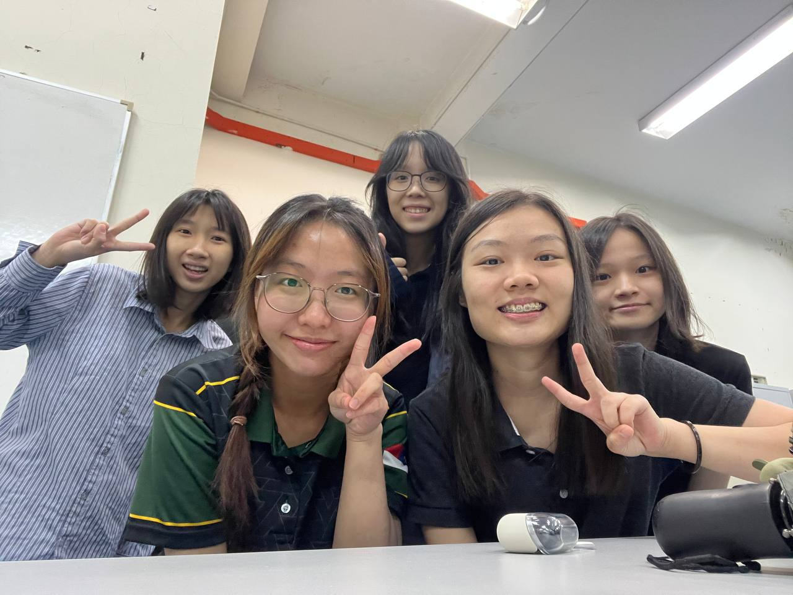
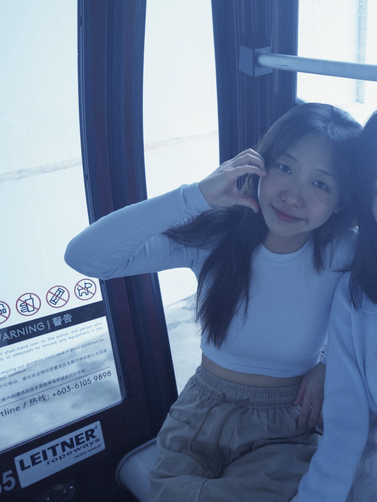

<h1 align="center">✨ Meet SuperIdol5 ✨ Your UX Dream Team from UTM JB</h1>

  

<strong>21.4.2025 – The debut of SuperIdol5!</strong>

---

### Hello World!

We’re **SuperIdol5** – five passionate UX dreamers from the Faculty of Computing, Universiti Teknologi Malaysia (UTM), Johor Bahru.

Our mission?  
To make tech more **human**, more **beautiful**, and more **you**.  
Because great user experience isn't just design – it’s storytelling, empathy, and a little sparkle. ✨

> _Why “SuperIdol5”?_  
Not because we look like K-pop stars (although we try) – but because we each believe in **owning our story** and shining in our own way.  
The ‘5’ stands for **us**, and our united power as a team.

---

## Meet the Members

<table align="center">
  <tr>
    <td align="center">
       
      <strong>Lee Jia Yee</strong> 
      <em>"Kindness is my superpower!"</em>
    </td>
    <td align="center">
       
      <strong>Gwee Zi Ni</strong> 
      <em>"Keep calm and sparkle on!"</em>
    </td>
    <td align="center">
       
      <strong>Leong Jia Ling</strong> 
      <em>"Chasing dreams with every beat!"</em>
    </td>
  </tr>
  <tr>
    <td align="center">
       
      <strong>Michelle Ho Chia Xin</strong> 
      <em>"Slay with grace and glitter!"</em>
    </td>
    <td align="center">
       
      <strong>Tay Xin Ying</strong> 
      <em>"Happy Go Lucky!"</em>
    </td>
    <td align="center">
       
    </td>
  </tr>
</table>

---

## Our First Project — JustiLink

> _Empowering justice, one link at a time._

**JustiLink** is a youth-friendly legal help platform designed to bridge the gap between vulnerable communities and the legal assistance they need. Many legal aid websites are cluttered, full of jargon, and difficult to access—especially for young people, immigrants, and marginalized groups.

**JustiLink** solves that by offering:

- A clean, mobile-first app and website
- Personalized legal service directories by issue (bullying, landlord disputes, immigration, etc.)
- Easy-to-understand guides with visuals, videos, and multilingual support
- An "anonymous first chat" option to reduce fear and make help feel more accessible

This project supports **SDG 16: Peace, Justice and Strong Institutions**, aiming to make justice approachable and inclusive.

**Target Users:**  
- Youths and students  
- Migrants and foreign workers  
- Low income families

→ Explore our vision in the [Project Proposal](Proposal.md)

---

---

### A Final Note  
> _"We’re not just idols – we’re a vibe."_  
Let’s design the future, one pixel and one heartbeat at a time.

---

  Made with heart by <strong>SuperIdol5</strong> – Faculty of Computing, UTM JB

