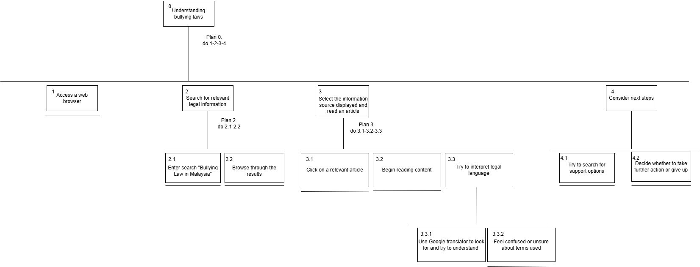
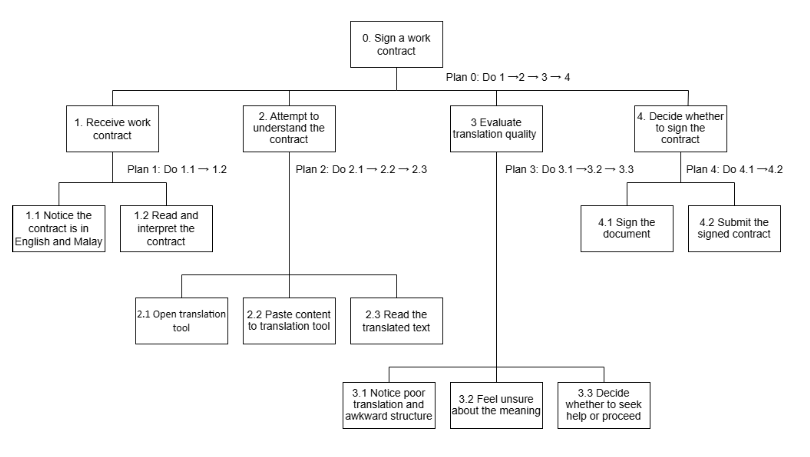
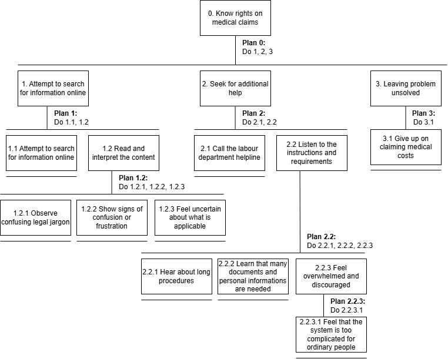
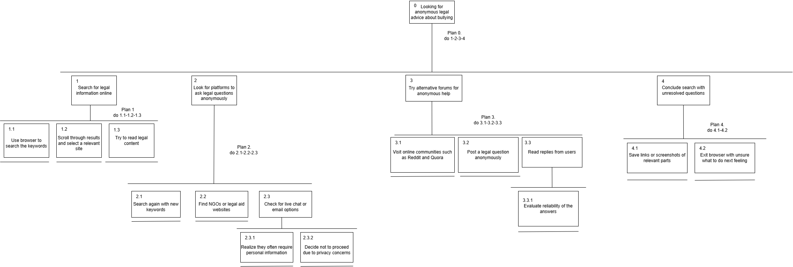
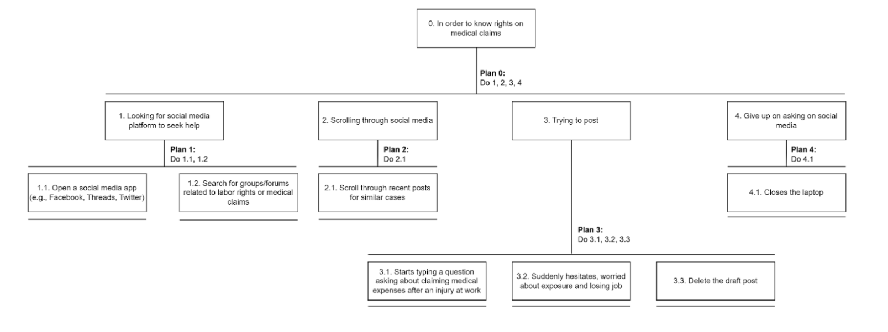

# Gathering Requirements - Task Analysis

## Introduction

This task analysis aims to understand how users currently find legal support through existing methods before the development of **JustiLink**. Users often rely on government websites, translation tools, or public forums, but these are not always accessible, user-friendly, or privacy-protected. Understanding these limitations is essential to designing a more effective legal support system.

---

# Task 1: Simplified Legal Content
 
## High School Student
 
*click here to watch the video👆*  

**Textual Presentation** 

0. Understand bullying laws  
 1. Access a web browser  
 2. Search for relevant legal information  
  2.1 Enter search “Bullying Law in Malaysia”  
  2.2 Browse through search results  
 3. Select the information source displayed and read an article  
  3.1 Click on a relevant article  
  3.2 Begin reading content  
  3.3 Try to interpret legal language  
   3.3.1 Use Google translator to look for and try to understand  
   3.3.2 Feel confused or unsure about terms used  
 4. Consider next step  
  4.1 Try to search for support options  
  4.2 Decide whether to take further action or give up  

**Plans**

- Plan 0: Do 1 → 2 → 3 → 4  
- Plan 2: Do 2.1 → 2.2  
- Plan 3: Do 3.1 → 3.2 → 3.3  
- Plan 3.3: Do 3.3.1 → 3.3.2  
- Plan 4: Do 4.1 → 4.2  

**Diagram Presentation**

 
Figure1: HTA of Joan performing Task 1 before without using JustiLink

---

## Migrant Construction Worker
 
*click here to watch the video👆* 

**Textual Presentation** 

0. Sign a work contract  
 1. Receive contract  
  1.1 Notice the contract is in English and Malay  
  1.2 Read and interpret the contract  
 2. Attempt to understand the contract  
  2.1 Open translation tool  
  2.2 Paste content to translation tool  
  2.3 Read the translated text  
 3. Evaluate translation quality  
  3.1 Notice poor translation and awkward structure  
  3.2 Feel unsure about the meaning  
  3.3 Decide whether to seek help or proceed  
 4. Decide whether to sign the contract  
  4.1 Sign the document  
  4.2 Submit the signed contract  

**Plans**

- Plan 0: Do 1 → 2 → 3 → 4  
- Plan 1: Do 1.1 → 1.2  
- Plan 2: Do 2.1 → 2.2 → 2.3  
- Plan 3: Do 3.1 → 3.2 → 3.3  
- Plan 4: Do 4.1 → 4.2  

**Diagram Presentation**

 
Figure2: HTA of Rahim Uddin performing Task 1 before without using JustiLink

---

## Office Worker
  
*click here to watch the video👆* 

**Textual Presentation**  

0. Know rights on medical claims  
 1. Attempt to search for information online  
  1.1 Use google to search for local employment laws  
  1.2 Read and interpret the content  
   1.2.1 Observe confusing legal jargon  
   1.2.2 Show signs of confusion or frustration  
   1.2.3 Feel uncertain about what is applicable  
 2. Seek for additional help  
  2.1 Call the labour department helpline  
  2.2 Listen to the instructions and requirements  
   2.2.1 Hear about long procedures  
   2.2.2 Learn that many documents and personal information are needed  
   2.2.3 Feel overwhelmed and discouraged  
    2.2.3.1 Feel that the system is too complicated for ordinary people  
 3. Leaving problem unsolved  
  3.1 Give up on claiming medical costs  

**Plans**

- Plan 0: Do 1 → 2 → 3  
- Plan 1: Do 1.1 → 1.2  
- Plan 1.2: Do 1.2.1 → 1.2.2 → 1.2.3  
- Plan 2: Do 2.1 → 2.2  
- Plan 2.2: Do 2.2.1 → 2.2.2 → 2.2.3  
- Plan 2.2.3: Do 2.2.3.1 → 3.1  
- Plan 3: Do 3.1  

**Diagram Presentation**

 
Figure3: HTA of Rahim Uddin performing Task 1 before without using JustiLink

### Findings from the HTAs for Task 1
1. **Technical Challenges** 
- Many users face delays due to slow website performance on basic devices. 
- Navigation elements often malfunction or fail to respond properly. 
- Visual obstructions and layout glitches make it hard to read or interact.

2. **Usability Issues** 
- Interfaces are poorly adjusted for small screen sizes. 
- Disorganized design and dense text reduce readability. 
- Users often cannot find or reach the legal information they’re looking for.

3. **Emotional & Behavioral Impact** 
- Confusion and irritation arise from unclear content and tool limitations. 
- Users frequently abandon the process before reaching a solution. 
- Negative experiences reduce trust and motivation to seek help again.
  
5. **Recommendations** 
- Create fast, efficient platforms that work well on all types of mobile devices. 
- Use clear structure, responsive design, and simplified features. 
- Present content in plain language and ensure intuitive navigation for everyone.

---

## Comparison of User Interactions in Task 1

| **Aspect**                    | **Joan(High School Student)**                                                                 | **Rahim Uddin(Migrant Construction Worker)**                                               | **Emma(Office Worker)**                                                          |
|------------------------------|------------------------------------------------------------------------------------------|-------------------------------------------------------------------------------|-----------------------------------------------------------------------------|
| **Motivation/Context**       | Learning rights due to **personal bullying** experience.                                 | Needs to **sign a work contract** with unclear content.                       | Tries to **claim medical benefits** but fears consequences.                |
| **Digital Literacy**         | Moderate – uses browser, search terms translation.                              | Moderate – uses translation tools but may not explore alternatives.           | Moderate – searches Google, attempts calling helpline.                     |
| **Language Barrier**         | Faces legal jargon, overcomes it with Google Translate and forums.                       | Major barrier – contract is in English/Malay, translation is poor.            | Struggles with legal terms but can read and understand to a basic extent.  |
| **Support-Seeking Behavior** | Proactively searches for forums, NGOs, alternative sources.                              | May avoid help due to fear, uncertainty, or lack of access.                   | Attempts to seek help (calls helpline), but finds it too complex.          |

### Similarities
All three users shared similar goals in Task 1, as they were trying to understand their rights or obligations related to legal or official matters. They all attempted to obtain information using digital platforms such as web searches, translation tools, or online help services. However, each of them encountered barriers when trying to comprehend the formal or legal content, which often contained complex or unfamiliar language. This difficulty caused confusion, uncertainty, and frustration during their search process. Additionally, all users expressed concerns about their privacy and feared exposure, whether due to embarrassment, potential job risks, or the requirement to enter personal data.

## 📊 HTA Comparison for Task 1 and Discussion
There are 3 personas involved in Task 1(Simplified the legal content) which are Joan(a high school student), Rahim Uddin(a migrant construction worker) and Emma(an office worker). Three of them tried to access legal information online regarding bullying laws, worker contract and employee legal rights. However, they face some challenges such as language barriers and complexity of legal jargon content when they are trying to understand their legal standing. The HTA above reveals the different user experiences and challenges.

### Differences
 Joan started her task by searching “bullying law in Malaysia” and browsing various different websites (HTA 2.1→2.2). She clicked the relevant article and struggled to read and understand the legal jargon (HTA 3.3) and finally feeling confused and unsure what the content would like to express (HTA 3.3.2). This highlights the complexity of legal language in the content and support brings the challenge to Joan.This also reflects her limited familiarity with legal content and her dependence on search results to guide her.

Rahim Uddin dealt with the legal content in a bilingual work contract. He used translation tools to struggle understanding the legal terms (HTA 2.1-2.3). However, the awkward translated sentence structure makes him still feeling unsure for the meaning of the content in the contract (HTA 3.1-3.5). Although he was uncertain about the context, he still signed the contract due to desire to earn money for his family (HTA 4.1). This highlighted how the language barriers and translation issues may cause the user to be forced into making uninformed decisions.

In contrast, Emma started her task by searching for rights or information about medical claims. When she was reading the content, she found that there was too much complicated legal language and still confused and unable to totally understand her right(HTA 1.2.1-1.2.3). She decided to seek additional help such as contacting the labour department(HTA 2). However, the too long process, too much documents required incurs the perceived complexity which causing her decided to give up (HTA 2.2-3.1).

### Similarities
All three users tried to understand their legal information whether by reading articles, using online tools or contacting authorities. In the end, none of them completed their task with clarity and confidence. Hence, these 3 HTA above showed the current legal content formats fail to serve users with language proficiency and legal knowledge.

### Design Implications
According to the HTA findings, we conclude the improvements and the features that are worth retaining to ensure the platforms is user friendly for different users with mastering different languages and legal knowledge

Improvement needed:
- Simplified legal content by using simple language and making them in clearer visual structure to prevent the complex legal jargon. Hence, all the users may easy to understand the content

- Support the multilingual and ensure its accurate and in relevant translations so that users with varying different languages skills may access the legal information

Features to keep:

- Maintain the simple and clean interface to ensure the users may navigate easily

- Keep font sizes are accessible and high contrast to improve readability

# Task 2: Seeking Anonymous Legal Advice
  
*click here to watch the video👆* 

### High School Student

**Textual Presentation**

0. Looking for anonymous legal advice about bullying  
 1. Search for legal information online  
  1.1 Use browser to search the keywords  
  1.2 Scroll through results and select a relevant site  
  1.3 Try to read legal content  
 2. Look for platforms to ask legal questions anonymously  
  2.1 Search again with new keywords  
  2.2 Find NGOs or legal aid websites  
  2.3 Check for live chat or email options  
   2.3.1 Realize they often require personal information  
   2.3.2 Decide not to proceed due to privacy concerns  
 3. Try alternative forums for anonymous help  
  3.1 Visit online communities such as Reddit and Quora  
  3.2 Post a legal question anonymously  
  3.3 Read replies from users  
   3.3.1 Evaluate reliability of the answers  
 4. Conclude search with unresolved questions  
  4.1 Save links or screenshots of relevant parts  
  4.2 Exit browser with unsure what to do next feeling  

**Plans**

- Plan 0: Do 1 → 2 → 3 → 4  
- Plan 1: Do 1.1 → 1.2 → 1.3  
- Plan 2: Do 2.1 → 2.2 → 2.3  
- Plan 2.3: Do 2.3.1 → 2.3.2  
- Plan 3: Do 3.1 → 3.2 → 3.3  
- Plan 3.3: Do 3.3.1  
- Plan 4: Do 4.1 → 4.2  

**Diagram Presentation**  
 
Figure4: HTA of Joan performing Task 2 before without using JustiLink

---

### Office Worker
  
*click here to watch the video👆* 

**Textual Presentation**

0. In order to know rights on medical claims  
 1. Looking for social media platform to seek help  
  1.1 Open a social media app (e.g., Facebook, Threads, Twitter)  
  1.2 Search for groups/forums related to labor rights or medical claims  
 2. Scrolling through social media  
  2.1 Scroll through recent posts for similar cases  
 3. Trying to post  
  3.1 Starts typing a question asking about claiming medical expenses after an injury at work  
  3.2 Suddenly hesitates, worried about exposure and losing job  
  3.3 Delete the draft post  
 4. Give up on asking on social media  
  4.1 Closes the laptop  

**Plans**

- Plan 0: Do 1 → 2 → 3 → 4  
- Plan 1: Do 1.1 → 1.2  
- Plan 2: Do 2.1  
- Plan 3: Do 3.1 → 3.2 → 3.3  
- Plan 4: Do 4.1  

**Diagram Presentation**  
 
Figure5: HTA of Emma performing Task 2 before without using JustiLink

---

### Findings from HTA Task 2

**Teqchnical Challenges**   
- Many platforms require personal information   
- Even “anonymous” online spaces may have digital traces  
- Risk of being identified by employers and friends
  
**Usability Issues**   
- Searched social media platforms and forums   
- Scrolled through posts but worried about exposure   
- Started typing a question but hesitated to post 
- Considered community resources, but information was unreliable  

**Emotional & Behavioral Impact**   
- Users felt overwhelmed, worried, and frustrated   
- Users eventually gave up on seeking help and felt unsupported

  **Accessibility Concerns** 
- Lack of trusted, private channels makes help inaccessible for people worried about privacy 

**Recommendations**  
- Create a platform where users can seek legal advice anonymously   
- Set up anonymous chatbots or helplines with instant responses   
- Transition to more detailed help only after user consent  

---

## Comparison of User Interactions in Task 2
| Aspect                              | Joan (High-School Student)                                                                                       | Emma (Office Worker)                                                                                                  |
|-------------------------------------|-------------------------------------------------------------------------------------------------------------------|-----------------------------------------------------------------------------------------------------------------------|
| **Background and Motivation**        | Motivated by personal safety and justice due to bullying, seeks understanding of her rights, uses digital tools comfortably. | Motivated by financial and job security after a work injury, but fears exposure, job loss, and complex processes.       |
| **Platforms and Paths Taken**        | Joan starts with browser searches, explores NGO sites, checks for live chats, and finally posts on forums like Reddit and Quora. | Emma uses social media platforms, tries posting but hesitates and deletes the post, then gives up.                      |
| **Struggles with Privacy and Emotions** | Joan faces uncertainty and confusion when platforms require personal information but still tries alternative forums. | Emma’s privacy concern is stronger—she worries not only about being identified but also about risking her job. This leads her to stop sooner than Joan. |
| **Emotional Journey and Final Outcome** | Feels hesitant but hopeful, continues searching, leaves with saved links, though her questions are unresolved.         | Feels overwhelmed, frustrated, and discouraged, and completely gives up without obtaining any useful information.        |
| **Who Uses the Shortest Path to Reach a Decision?** | Emma takes the shortest route. She moves from seeking information to deciding not to post and closes her laptop. Her journey ends faster due to greater fear of exposure. | Joan takes a longer, more exploratory path, checking multiple online sources, trying to read content, and even saving links. Despite feeling hesitant, she does not completely abandon the task. |

### Similarities
Both Joan and Emma faced privacy worries when platforms asked for personal details. Neither was able to get clear, trustworthy advice anonymously. They both felt confused, frustrated, and ended their searches without answers.

# 📊 HTA Comparison for Task 2 and Discussion

There are 2 personas involved in Task 2 (Anonymous First Chat Feature) which are Joan(a high school student) and Emma (an office worker). Both of them tried to find anonymous features to seek legal advice online but their decision-making processes are different due to privacy concerns.

### Differences
Joan started her task by looking for legal help about bullying by using a browser. She tried to read the content that has a similar situation with her but finally decided to look for platforms to ask legal questions anonymously. She explored various NGO websites and checked for chat or email options but finally did not choose this option due to privacy concerns (HTA 2.1→2.3). Then she turned to online communities like Reddit or Quora  to post her legal question anonymously for obtaining answers(HTA 3.1→3.3). She used various platforms that required personal information and felt uncertain showing that she was willing to try informal sources instead of the formal one to ensure her identity will not be revealed.

Emma started her task with looking for a social media platform for learning and understanding medical claims(HTA 1.1→2.1). She typed a question asking for help (step 3.1), but after hesitating due to fear of being identified and risking her job, she deleted the post and exited (step 3.3 → 4.1). Her HTA path was shorter, and she disengaged faster compared to Joan, showing that privacy anxiety had a stronger impact on her actions.

### Similarities
Both users struggled with platforms requiring personal information, which made them feel exposed and vulnerable (HTA step 2.3.1 and 3.2). Despite using different platforms, they both failed to find a trusted, truly anonymous legal advice source. Their experiences reflected emotional states like worry, confusion, and frustration, leading both of them to end the task without getting the help they needed. These patterns suggest that current digital tools are not designed well for users seeking anonymous legal guidance.

### Design Implications
HTA analysis suggests several areas for improvement while also highlighting elements that should be preserved.

Improvement needed:

- Provide anonymous communication channels (e.g., chatbots or masked emails) to protect user privacy.

- Introduce step-by-step guidance and reduce sign-up barriers to improve user trust and comfort.

Features to keep:

- Preserve clear privacy policy statements to reassure users about data protection.

- Retain current features that guide users toward reliable legal sources without overwhelming legal jargon.

---
## Task 3: Mobile-First, User-Centered Interface
  
*click here to watch the video👆* 

### Migrant Construction Worker

**Textual Presentation**

0. Find legal help online  
 1. Search for legal rights  
  1.1 Use mobile phone to search for legal aid websites  
  1.2 Click on a relevant legal aid website  
 2. Interact with the legal aid website  
  2.1 Wait for the page to load  
  2.2 Navigate the site  
   2.2.1 Scroll through content  
   2.2.2 Try to go to the next page  
   2.2.3 Wait for delayed response  
 3. Give up on accessing legal aid  
  3.1 Exit the website  
  3.2 Put phone away  

**Plans**

- Plan 0: Do 1 → 2 → 3  
- Plan 1: Do 1.1 → 1.2  
- Plan 2: Do 2.1 → 2.2  
- Plan 2.2: Do 2.2.1 → 2.2.2 → 2.2.3  
- Plan 3: Do 3.1 → 3.2  

**Diagram Presentation**  

 
Figure6: HTA of Radhim Uddin performing Task 3 before without using JustiLink

---

### Office Worker
  
*click here to watch the video👆* 

**Textual Presentation**

0. Access legal help on a budget smartphone  
 1. Connect to public Wi-Fi  
  1.1 Turn on Wi-Fi on phone  
  1.2 Select and connect to available public Wi-Fi  
 2. Search for employee legal help  
  2.1 Open web browser  
  2.2 Type “employee legal help Malaysia” in search bar  
  2.3 Tap on a relevant search result  
 3. Interact with the legal website  
  3.1 Wait for the website to load  
  3.2 Notice lag and slow response  
  3.3 Try to zoom or scroll (unsuccessfully)  
  3.4 Attempt to tap buttons (some not working)  
  3.5 Close or dismiss pop-up blocking content  
 4. Assess usability of the site  
  4.1 Observe poor layout and cluttered design  
  4.2 Get frustrated with navigation and readability  
  4.3 Notice phone heating up and battery draining  
 5. Decide to continue or exit  
  5.1 Decide to exit website to save battery and data  
  5.2 Feel disappointed with the experience  

**Plans**

- Plan 0: Do 1 → 2 → 3 → 4 → 5  
- Plan 1: Do 1.1 → 1.2  
- Plan 2: Do 2.1 → 2.2 → 2.3  
- Plan 3: Do 3.1 → 3.2 → 3.3 → 3.4 → 3.5  
- Plan 4: Do 4.1 → 4.2 → 4.3  
- Plan 5: Do 5.1 → 5.2  

**Diagram Presentation**  

Figure7: HTA of Emma performing Task 3 before without using JustiLink

---

### Findings from HTA Task 3

**1. Technical Barriers**  
- Websites load slowly on low-end phones  
- Buttons and navigation are unresponsive or buggy  
- Pop-ups block content; users can't zoom or scroll properly  
- Phones overheat or drain battery  

**2. Usability Issues**  
- Interfaces not optimized for mobile  
- Layouts cluttered; text hard to read  
- Users struggle to navigate content  

**3. Emotional and Behavioral Impact**  
- Users feel frustrated, confused, and disappointed  
- Many give up without getting help  
- Emotional stress discourages further attempts  

**4. Accessibility Concerns**  
- Legal websites unsuitable for users with basic phones or poor internet  
- Digital inequality limits access to justice  

**5. Recommendations**  
- Design lightweight, mobile-friendly legal platforms  
- Ensure fast loading, clean layout, working buttons  
- Simplify navigation and content for all literacy levels

# Comparison of User Interactions in Task 3
 | Aspect                               |  Rahim Uddin(Migrant Construction Worker)                                                    | Emma(Office Worker)                                                                              |
| ------------------------------------ | ------------------------------------------------------------------------------- | ------------------------------------------------------------------------------------------ |
| **Background & Motivation**          | Rahim Uddin uses basic phone user limited data to seek legal rights information              | Emma uses budget smartphone user on public Wi-Fi to seek employee legal help                          |
| **Starting Point**                   | Rahim Uddin starts with searching “legal rights” via mobile browser                                      | Emma starts with searching “employee legal help Malaysia” via browser                                        |
| **Interaction & Emotional Response** | Faces slow loading and confusing navigation; quickly frustrated and exits early | Encounters lag, unresponsive buttons, and pop-ups; frustrated but persists before quitting |
| **Main Challenges**                  | Device limitations, low digital literacy, slow site performance                 | Poor UI design, lag, device overheating, and battery drain                                 |

### Similarities
Both the migrant construction worker and the office worker tried to find legal help online by searching on their devices and visiting legal aid websites. Although they used different devices and had different levels of digital skills, they faced similar problems such as slow website loading, difficult navigation, and technical issues. These problems made both users feel frustrated and unhappy, which led them to stop using the websites before finishing their tasks. This shows that no matter what device or background the user has, online legal help platforms need to be easy to use, quick to load, and designed for people with different skills and devices. 

# 📊 HTA Comparison for Task 3 and Discussion

Task 3 involved two personas: the Rahim Uddin,a migrant construction worker and Emma,the office worker, both attempting to find legal help through their mobile devices. Although they shared the same goal, their experiences differed due to factors such as digital literacy, device limitations, and interface usability.
### Differences

Rahim Uddin searched for legal rights using his mobile phone and tried to access a legal aid website. According to his HTA, he navigated the site briefly but gave up after experiencing slow page loading and difficulty scrolling (HTA step 2.2.3 → 3.1). This shows that he may have limited experience with online platforms and quickly disengages when the interface is not responsive.

In contrast, Emma demonstrated more digital confidence. She first connected to public Wi-Fi before searching for employee legal help (HTA step 1 → 2). Although she encountered various interface issues such as pop-up interruptions and unresponsive buttons (step 3.4 → 3.5), she still made several attempts to interact with the content before exiting. This indicates that she was more persistent but still hindered by poor design and usability on her budget smartphone.

### Similarities

Despite their differences, both users encountered challenges that led them to abandon the task. They both faced long loading times (HTA 3.1), cluttered layout (4.1), and frustration with unresponsive website elements. Neither user was able to complete their goal of finding useful legal help, highlighting usability issues that affect users across different backgrounds.

### Design Implications
Insights from the HTA show what should be improved and what already works well for users with varying digital literacy levels.

Improvement needed:

- Prioritize fast loading speeds and responsive design, especially for low-end devices.

- Reduce distractions, such as pop-ups and unresponsive interface elements.

Features to keep:

- Maintain the straightforward and lightweight system design that suits users with limited technical skills.

- Continue ensuring compatibility across a variety of devices to support diverse user needs.

## 📋Design Requirements

The JustiLink system design needs to keep the things users are already familiar with: being able to search for legal information online, through websites, apps, or social media. These platforms help people start learning about their rights and get a sense of what steps they might need to take. But just keeping these isn’t enough. Many users, like Emma, face confusing and complicated systems that leave them feeling overwhelmed.

That’s why we need to introduce new, user-friendly solutions. First, there should be safe, anonymous ways for people to ask questions or seek legal help—whether through a chatbot or a secure hotline—without needing to expose their personal information. The legal information itself needs to be clear, easy to read, and broken down into simple steps, so anyone can understand it. Since many users access these services on their phones, the design has to work well (faster loading, cleaner layouts, and easy-to-use navigation) on all devices, especially on older models with slower internet. Lastly, the system should make it clear how their information is protected and give them choices about what they share, to let people feel safe and in control.
